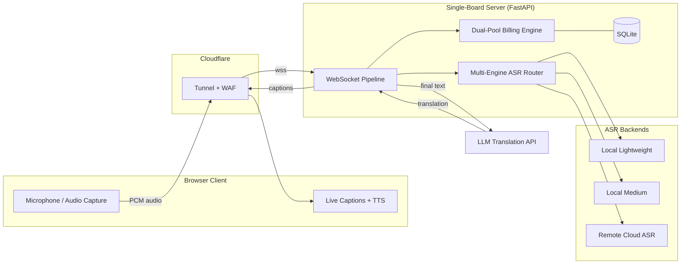

**English** | [中文](#中文)

# BroN-translate

**Real-time AI translation gateway for international students and cross-border meetings.**

A solo-built, full-stack system that delivers live speech-to-text translation in
lecture halls and presentations — running on a single-board server, with a
multi-engine ASR pipeline, LLM-powered translation, real-time WebSocket
streaming, and a usage-metered billing system.

> ⚠️ **Note on this repository.** This is a *curated showcase* of the project's
> architecture and engineering decisions, not the full production source.
> Core logic is presented as **design documents and pseudocode** (see [`docs/`](docs/)).
> The live product is closed-source.

---

## Why I built it

I'm an international student. Sitting through lectures in a non-native language,
I kept losing the thread — by the time I'd parsed one sentence, the lecturer was
three slides ahead. Existing tools were either too generic, too expensive, or
too shallow for an academic workflow.

So I built my own: a tool I use **every day** in my own classes, and that I also
ship as a product. Being both the builder and the primary user means every
design decision gets validated against real lecture pacing — not hypotheticals.

## What it does

- **Real-time transcription** of live speech with sub-second interim captions.
- **LLM translation** with domain-aware terminology injection (e.g. a per-course
  vocabulary so "gradient descent" isn't mistranslated).
- **Audio-first delivery** — translated text can be read back via TTS, designed
  to reduce *visual* attention load while you're trying to watch the lecturer.
- **Room broadcasting** — one host's transcription stream shared to multiple
  listeners.
- **Document translation** — batch translation of lecture materials (TXT / DOCX / PDF).

## Architecture

### Design deep-dives

| Document | What it covers |
|---|---|
| [Multi-Engine ASR Routing](docs/asr_engine_routing.md) | Pluggable engine interface, tier-driven routing, concurrency protection, graceful degradation |
| [Dual-Pool Billing Design](docs/billing_design.md) | Two-balance quota model, perishable-first deduction, lazy expiry, tier transitions |

## Tech stack

| Layer | Technology |
|---|---|
| Backend | Python, FastAPI, WebSockets (asyncio) |
| ASR | Local CPU inference + cloud ASR API (multi-engine, hot-swappable) |
| Translation | LLM API with terminology injection |
| Storage | SQLite |
| Infra | Single-board server, Cloudflare Tunnel, Cloudflare Pages |
| Realtime | WebSocket audio streaming, PCM chunk pipeline |

## Key engineering decisions

These are the choices I'd actually talk about in an interview — the *why*, not
just the *what*.

- **Multi-engine ASR instead of one model.** No single engine wins on cost,
  accuracy, *and* latency simultaneously. A pluggable layer routes casual use to
  free local inference and premium use to a cloud API, keeping marginal cost
  near zero on constrained hardware. → [details](docs/asr_engine_routing.md)

- **TTS playback uses a queue, not cancellation.** Counterintuitive, but it
  comes from watching real lectures: speech comes in bursts with natural pauses.
  A queue that drains during those pauses produces smoother playback than
  aggressively cancelling and restarting on every new utterance.

- **Dual-pool billing instead of a single balance.** Subscription minutes should
  expire monthly; paid-outright minutes shouldn't. Two different expiry rules
  can't live in one number — so two pools, spending the perishable one first to
  maximize subscriber value. → [details](docs/billing_design.md)

- **Lazy expiry over scheduled jobs.** On a single-board server, a per-account
  cron scheduler is wasteful. Quota expiry is evaluated on access instead —
  stateless and cheap.

- **Graceful degradation under load.** When the heavier local model is at
  capacity, sessions fall back to the lightweight engine rather than failing.
  Users get *lighter* transcription, never an error page.

---
---

[English](#bron-translate) | **中文**

# BroN-translate

**面向留学生与跨国会议的实时 AI 翻译网关。**

一个由我独立开发的全栈系统，在课堂与演讲场景中提供实时语音转写与翻译——
部署在单板服务器上，包含多引擎 ASR 管线、大模型翻译、实时 WebSocket 流式传输，
以及一套基于用量计费的系统。

> ⚠️ **关于本仓库。** 这是项目**架构与工程决策的精选展示**，并非完整的生产源码。
> 核心逻辑以**设计文档与伪代码**形式呈现（见 [`docs/`](docs/)）。
> 线上产品为闭源。

---

## 我为什么做这个

我是一名留学生。用非母语听课时，我总是跟不上——刚把一句话理解透，
讲师已经翻过三页 PPT 了。现有工具要么太通用、要么太贵、要么对学术工作流的支持太浅。

于是我自己造了一个：一个我**每天**在自己课堂上使用、同时也作为产品上线的工具。
既是开发者又是核心用户，意味着每一个设计决策都经过真实课堂节奏的检验，而非纸上谈兵。

## 它能做什么

- **实时转写**——亚秒级的临时字幕预览。
- **大模型翻译**——带领域术语注入（例如按课程配置的词库，避免 "gradient descent"
  被误译）。
- **音频优先的呈现**——翻译结果可通过 TTS 朗读，设计目标是在你盯着讲师时
  **降低视觉注意力负担**。
- **房间广播**——一位主讲的转写流共享给多名听众。
- **文档翻译**——批量翻译课程材料（TXT / DOCX / PDF）。

## 架构

> 架构图见上方英文部分的 Mermaid 图（GitHub 会自动渲染）。
> 数据流：浏览器采集音频 → Cloudflare 隧道 → FastAPI 服务器（WebSocket 管线 →
> 多引擎 ASR 路由 → 大模型翻译 → 双池计费 → SQLite）→ 字幕回传客户端。

### 设计深度剖析

| 文档 | 涵盖内容 |
|---|---|
| [多引擎 ASR 路由](docs/asr_engine_routing.md) | 可插拔引擎接口、按档位路由、并发保护、优雅降级 |
| [双池计费设计](docs/billing_design.md) | 双余额额度模型、易逝额度优先扣除、惰性过期、档位切换 |

## 技术栈

| 层 | 技术 |
|---|---|
| 后端 | Python、FastAPI、WebSockets（asyncio） |
| ASR | 本地 CPU 推理 + 云端 ASR API（多引擎、可热切换） |
| 翻译 | 大模型 API + 术语注入 |
| 存储 | SQLite |
| 基础设施 | 单板服务器、Cloudflare Tunnel、Cloudflare Pages |
| 实时 | WebSocket 音频流、PCM 分块管线 |

## 关键工程决策

这些是我在面试里真正会讲的部分——讲**为什么**，而不只是**做了什么**。

- **多引擎 ASR，而非单一模型。** 没有任何单一引擎能同时在成本、精度、延迟上都最优。
  可插拔层把日常使用路由到免费本地推理、把高级用量路由到云 API，
  在受限硬件上把边际成本压到接近零。→ [详情](docs/asr_engine_routing.md)

- **TTS 播放用队列，而非取消。** 反直觉，但这来自对真实课堂的观察：
  语音是带自然停顿的阵发式输入。让队列在停顿期间排空，
  比每来一句就激进地取消重启，播放效果更平滑。

- **双池计费，而非单一余额。** 订阅分钟应当按月过期；一次性买断的分钟则不应过期。
  两套不同的过期规则无法塞进一个数字里——于是用两个池，
  并优先扣除易逝的那个，以最大化订阅价值。→ [详情](docs/billing_design.md)

- **惰性过期，而非定时任务。** 在单板服务器上，为每个账户跑 cron 调度很浪费。
  额度过期改为在访问时评估——无状态且廉价。

- **负载下的优雅降级。** 当较重的本地模型满载时，会话回退到轻量引擎而非直接失败。
  用户得到的是**更轻量**的转写，而绝不是一个报错页面。

